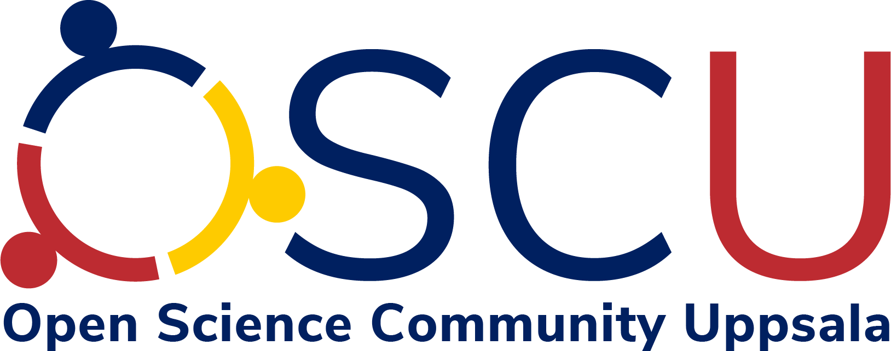

Open Science Community Uppsala ('OSCU') is the Open Science community in Uppsala.
At OSCU, we have a monthly presentation at Stadsbilioteket,
where one can meet other people that are fond and/or critical about Open Science.

Our main page is at [https://bit.ly/osc_uppsala](https://bit.ly/osc_uppsala).

We are always looking for:

 1. People to spread the word about OSU
 2. People that attend the OSU meetings
 3. People that would like to give a talk at OSU
 4. People that would like to be an OSU volunteer

